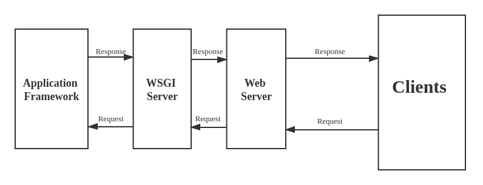

Nowadays, Python becomes one of the most popular language for Web development. There are many famous websites such as Instagram, Disqus and so on using it. This post will talk about the backend architecture of a Python web application.

## Overview of the Architecture

There are three common components (layers) in the backend side of a Python web application:
- A web server (such as Nginx / Apache)
- A WSGI application server (such as Gunicorn / uWSGI)
- A web application framework (such as Django / Flask)

Their relationships are as follows:

## 1. Web Server Layer
First of all, we need a web server to receive HTTP requests and send back responses containing status code and other contents such as HTML, XML or JSON as well.

There are lots of web server implementations suitable for Python web service. Considering ease of use, stability, security, market share and other issues, Apache and Nginx are most popular. The Apache HTTP Server has been the most commonly deployed web server on the Internet for 20+ years. Nginx is the second most commonly used server for the top 100,000 websites.

## 2. WSGI Server Layer
A traditional web server does not understand or have any way to run Python applications. Therefore, the Python community came up with WSGI as a standard interface that modules and containers could implement. WSGI is now the commonly accepted approach for running Python web applications on web servers.

Because WSGI is just a standard interface, there are also different implementations of WSGI server base on that to help Python applications communicate with web servers. Gunicorn and uWSGI are two most popular WSGI servers.

There are two main benefits from a good WSGI server:
- **Flexibility:** 
The WSGI makes the three layers of Python web server be low coupling. It would separate choice of application frameworks from choice of web servers, freeing developers to choose a pairing that suits them, while freeing framework and server developers to focus on their preferred area of specialisation. It does not really care what we used to build our web application — as long as it can be interacted with using the WSGI interface.

- **Promote scaling:** 
Serving thousands of requests for dynamic content at once is the domain of WSGI servers, not frameworks. WSGI servers handle processing requests from the web server and deciding how to communicate those requests to an application framework’s process. The segregation of responsibilities is important for efficiently scaling web traffic.

To summary, WSGI server takes care of everything which happens in-between the web server and the web application. This way, when coding up a Python application we don’t need to find solutions for:

- Communicating with multiple web servers
- Reacting to lots of web requests at once and distributing the load
- Keeping multiple processes of the web application running

## 3. Web application framework layer
Python’s web application framework makes the process of app development much easier. A framework implements common issues for a web application (such as template system, ORM (Object Relational Mapping) systems, user authentication, content administration, site maps, RSS feeds, and many more tasks) and we just need to develop our commercial logic upon it.

There are also many application frameworks for Python web development. Such as Django, Flask and Tornado.
